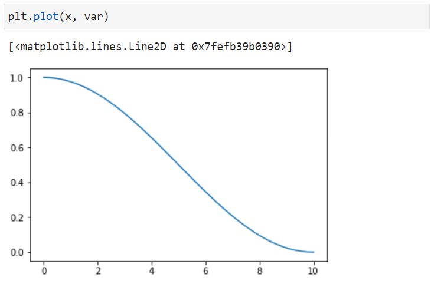
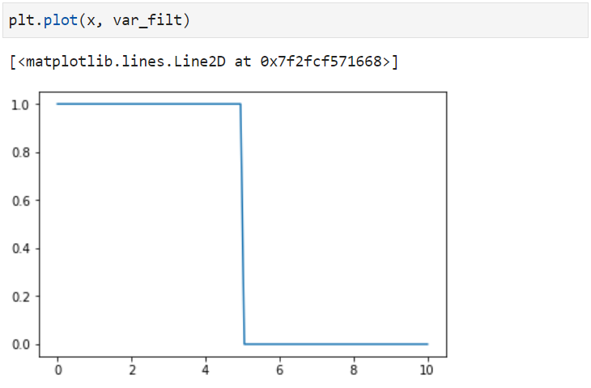

In the domain of topology optimization, we aim to get the result that is competent for manufacturing without any post-processing. But it is observed that for most of the cases the topologically optimized structure demands post-processing, and it becomes computationally expensive. In a practical situation, it is evident that the domain should have a primary density variable’s value of zero or one, which can be achieved by using Threshold projection. Mathematically it is given by:

$$\bar{\rho}_{e}=\frac{\tanh (\beta \eta)+\tanh \left(\beta\left(\tilde{\rho}_{e}-\eta\right)\right)}{\tanh (\beta \eta)+\tanh (\beta(1-\eta))}$$

Here rho is the filtered variable, obtained from a linear projection.

The parameter $\beta > 0$ controls the nonlinearity of the filtered variable. For $\beta \to 0$ we have a linear behavior between physical and filtered variables, whereas $\beta \to \infty $, we have a Heaviside step function. the value of $\beta$ plays an important role in the accuracy of the filtered result.

The primary variable which is of our concern should be either zero or 1. It is not desired to get a value that is between 0 - 1. For $\eta = 1$.

Here in this blog, I have tried to explain it using a small python implementation to get a more realistic feel of what is really happening using this threshold projection implementation.

```python
import numpy as np
import math
import matplotlib.pyplot as plt

l = 10
rho = []

x = np.linspace(0,l,100)
var = (np.cos(x/10 *np.pi) +1)/2

#Input parameters
beta = 2000
eta = 0.5
d = var-sigma

a = np.tanh(beta*eta)
b = np.tanh(beta*(d))
c = np.tanh(beta*(1-eta))

nr = a + b
dr = a + c

var_filt = nr/dr
```







It is evident from the above two plots that the function, changes to zero and one solution once we have applied threshold projection to it.